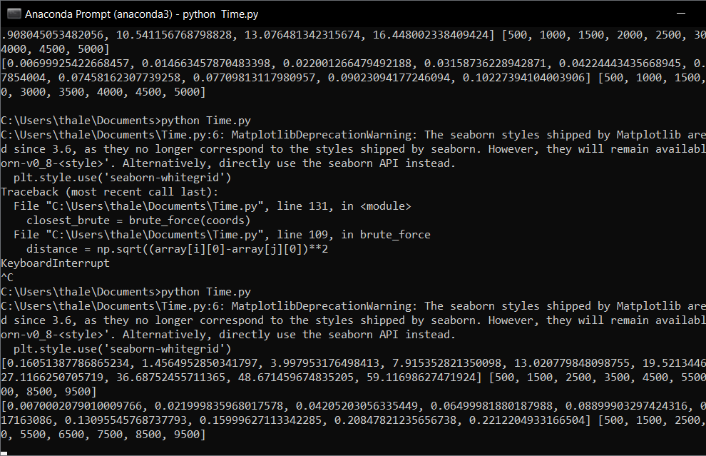
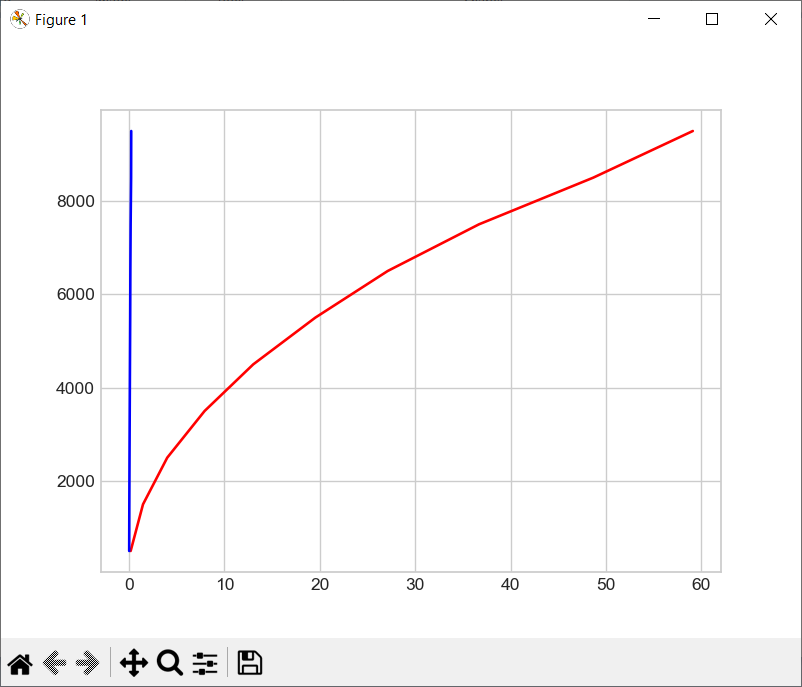
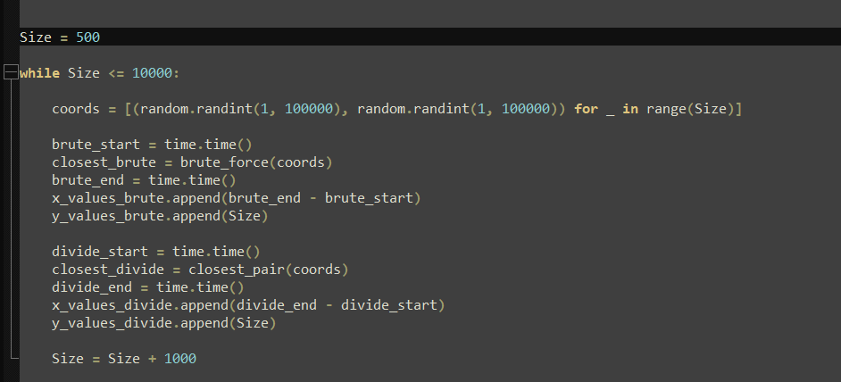

# Shortest Path Efficiency

**Número da Lista**: 40 
**Conteúdo da Disciplina**: Dividir e Conquistar 

## Alunos
|Matrícula | Aluno |
| -- | -- |
| 16/0112028  |  André Goretti Motta |

## Sobre 
Esse projeto tem como objetivo botar em pratica a aula passada para o professor e mostrar a diferença de performance em achar a menor distancia entre dois pontos. 
Para mostrar isso foi feito algumas interações aumentando a quantidade de pontos a cada um e plotando esses pontos em um gráfico em função do tempo no final.

## Screenshots

## Instalação 
**Linguagem**: Python 
Istale Python seguindo recomendações padrões
Instale as bibliotecas se nescessário: 
`pip install matplotlib` 
`pip install numpy` 

## Uso 
Rode `python Time.py` dentro da pasta do repositorio e espere que demora um tempo para fazer todas as interações. 
Se quiser, pode se alterar os valores de `Size` e `Size = Size + 1` para mudar a quantidade de interações no codigo na parte mostrada na terceira imagem.

